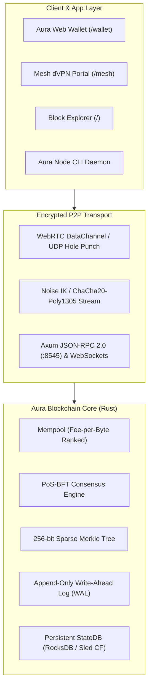

<div align="center">

# 🌐 Aura Network & Blockchain

**Production-Grade Modular Proof-of-Stake BFT Blockchain, Non-Custodial Web Wallet & Encrypted Peer-to-Peer Mesh dVPN Ecosystem.**

[](./LICENSE)
[](https://www.rust-lang.org/)
[](https://nextjs.org/)
[]()
[]()
[](https://vercel.com)

---

</div>

## 📌 Table of Contents
- [Executive Overview](#-executive-overview)
- [Key Features](#-key-features)
- [System Architecture](#-system-architecture)
- [Workspace Crates Breakdown](#-workspace-crates-breakdown)
- [Quick Start Guide](#-quick-start-guide)
- [Web Portal & Explorer](#-web-portal--explorer)
- [Deploying on Vercel](#-deploying-on-vercel)
- [How Anyone Can Join Our Code Building Journey](#-how-anyone-can-join-our-code-building-journey)
- [Roadmap](#-roadmap)
- [License](#-license)

---

## 🌟 Executive Overview

**Aura (`AUR`)** is an enterprise-grade, from-scratch modular cryptocurrency and decentralized mesh communication protocol written in **Rust** and **TypeScript (Next.js 14)**. 

It solves two massive challenges simultaneously:
1. **Financial & State Sovereignty:** A high-throughput, low-latency PoS-BFT blockchain with domain-separated BLAKE3 hashing, deterministic Ed25519 signatures, RFC 6962 Merkle Trees, and an authenticated 256-bit Sparse Merkle Tree (SMT) state engine.
2. **Decentralized Bandwidth Sovereignty:** A zero-knowledge Peer-to-Peer (P2P) remote bandwidth-sharing and dVPN tunnel network allowing users to route 100% of their mobile and desktop traffic through high-speed residential nodes (even 1000 km away) with ChaCha20-Poly1305 encryption and micro-payment monetization in native `AUR` tokens.

---

## ⚡ Key Features

* **🛡️ 2-Phase Byzantine Fault Tolerant (PoS-BFT) Consensus:** Sub-2 second deterministic block finality with stake-weighted leader selection, Quorum Certificates ($>2/3$ stake weight), and automated equivocation (double-signing) slashing.
* **🌲 Authenticated 256-Bit Sparse Merkle Tree (SMT):** Global `state_root` computed deterministically across accounts, balances, and nonces with crash-resilient Write-Ahead Logging (WAL) and CRC32 checksums.
* **🚀 Priority-Queue Mempool with Nonce Sequencing:** Stateless & stateful validation, Replace-By-Fee ($\ge 10\%$), fee-per-byte ordering, and anti-DoS capacity limits.
* **📡 Zero-Knowledge P2P Mesh Tunnel (Aura Mesh dVPN):** Ephemeral Curve25519 Diffie-Hellman handshake (Noise Protocol IK), WebRTC / UDP carrier-grade NAT hole punching, local SOCKS5 proxy (`127.0.0.1:1080`), and Android `VpnService` support.
* **💬 Direct P2P Encrypted Chat & Media File Transfer:** Phone-to-phone direct binary stream (64KB chunks) with zero intermediate cloud storage or ISP snooping.
* **💳 Non-Custodial Web Wallet:** Client-side 12-word BIP-39 mnemonic generation, Ed25519 private key derivation, instant Bech32 address generation (`aura1...`), and 1-click JSON-RPC broadcasting.
* **☀️ Ultra-Clean Light Mode Web Dashboard:** Built with Next.js 14 App Router, Tailwind CSS, and Plus Jakarta Sans / JetBrains Mono typography.

---

## 🏗️ System Architecture



---

## 📦 Workspace Crates Breakdown

The Rust backend is structured as an enterprise-grade 11-crate Cargo workspace:

| Crate | Path | Purpose |
|---|---|---|
| **`aura-crypto`** | `crates/aura-crypto` | Domain-separated BLAKE3 hashing, Ed25519 signing/verification, BIP-173 Bech32 (`aura1...`), BIP-39/44 HD key derivation. |
| **`aura-primitives`** | `crates/aura-primitives` | Block headers, Account transactions, RFC 6962 Merkle Tree with inclusion proofs, Quorum Certificates, Genesis block config. |
| **`aura-storage`** | `crates/aura-storage` | Authenticated 256-bit Sparse Merkle Tree (SMT), Column-Family KV store, Write-Ahead Log (WAL), atomic state commits & rollbacks. |
| **`aura-mempool`** | `crates/aura-mempool` | Multi-index pending transaction pool, fee-per-byte ordering, nonce sequencing, Replace-By-Fee ($\ge 10\%$). |
| **`aura-consensus`** | `crates/aura-consensus` | 2-Phase BFT State Machine (Propose $\rightarrow$ Pre-Vote $\rightarrow$ Pre-Commit $\rightarrow$ Commit), stake-weighted proposer selection, slashing. |
| **`aura-network`** | `crates/aura-network` | P2P wire protocol (`TxGossip`, `BlockGossip`, `Consensus`), peer reputation scoring, chain synchronization. |
| **`aura-rpc`** | `crates/aura-rpc` | High-throughput JSON-RPC 2.0 (`/rpc`) and live WebSocket (`/ws`) event subscriptions. |
| **`aura-metrics`** | `crates/aura-metrics` | Prometheus metrics telemetry (`/metrics`). |
| **`aura-tunnel`** | `crates/aura-tunnel` | ChaCha20-Poly1305 packet cipher, Noise IK handshake, SOCKS5 client proxy, Exit Node NAT forwarder, micro-payment billing. |
| **`aura-node`** | `crates/aura-node` | Daemon CLI executable (`keygen`, `init`, `run`, `tx send`, `tx balance`). |
| **`aura-test-harness`** | `crates/aura-test-harness` | Multi-node cluster simulation and Byzantine fault tolerance verification suites. |

---

## 🚀 Quick Start Guide

### Prerequisites
- [Rust 1.75+](https://rustup.rs/)
- [Node.js 18+ or 20+](https://nodejs.org/)

### 1. Clone Repository
```bash
git clone https://github.com/viroaryan/Aura-Blockchain.git
cd Aura-Blockchain
```

### 2. Generate Validator Keys & Init Genesis
```bash
# Generate deterministic Ed25519 keypair
cargo run --bin aura-node -- keygen

# Initialize Genesis block and ledger state
cargo run --bin aura-node -- init --data-dir ./.aura-data
```

### 3. Launch the Blockchain Node
```bash
cargo run --bin aura-node -- run \
  --data-dir ./.aura-data \
  --rpc-addr 127.0.0.1:8545 \
  --p2p-addr 127.0.0.1:9000
```

### 4. Send a Transaction via CLI
```bash
cargo run --bin aura-node -- tx send \
  --from-secret <SENDER_SECRET_KEY_HEX> \
  --to aura1f4g7j2k9l0m3n5p7r9t1v3x5z7b9d1f3h5j7k \
  --amount 10000000 \
  --fee 1000 \
  --rpc-url http://127.0.0.1:8545
```

---

## 🌐 Web Portal & Explorer

Run the modern Next.js 14 web application locally:

```bash
cd explorer
npm install
npm run dev
```

Open in your browser:
* 🔍 **Block Explorer:** [http://localhost:3000](http://localhost:3000)
* 💳 **Web Crypto Wallet:** [http://localhost:3000/wallet](http://localhost:3000/wallet)
* 📡 **Mesh dVPN & Remote Hotspot:** [http://localhost:3000/mesh](http://localhost:3000/mesh)
* 🛡️ **Validator Set:** [http://localhost:3000/validators](http://localhost:3000/validators)

---

## ⚡ Deploying on Vercel

The frontend is 100% optimized for **Vercel** with instant global Edge CDN and free SSL for WebRTC P2P DataChannels.

### Step-by-Step Vercel Deployment:
1. Push your repository to GitHub:
   ```bash
   git add .
   git commit -m "feat: complete Aura blockchain & dVPN ecosystem"
   git push origin main
   ```
2. Go to [vercel.com](https://vercel.com) $\rightarrow$ **"Add New Project"**.
3. Select your repository `Aura-Blockchain`.
4. In Project Settings:
   * **Root Directory:** Set to **`explorer`**
   * **Framework Preset:** `Next.js`
5. Click **"Deploy"**!

---

## 🤝 How Anyone Can Join Our Code Building Journey

We believe in a fully open, transparent, and collaborative building culture. Anyone from anywhere in the world can contribute:

```
┌──────────────────────────────────────────────────────────────┐
│             AREAS WHERE YOU CAN CONTRIBUTE                   │
├──────────────────────────────────────────────────────────────┤
│ 🦀 Core Systems (Rust):                                       │
│    - EVM / WASM smart contract virtual machine integration   │
│    - Multi-hop Onion Routing for the dVPN tunnel             │
│    - Advanced P2P Kademlia DHT node discovery                │
│                                                              │
│ 💻 Frontend & Web3 (TypeScript/React):                       │
│    - Web Wallet UX improvements & Token Faucet               │
│    - Multi-language localization (Hindi, Spanish, French)    │
│    - Dark / Light mode instant switcher                      │
│                                                              │
│ 📱 Mobile Development:                                       │
│    - Android Kotlin Background VpnService Client (APK)       │
│    - iOS Swift NetworkExtension Client                       │
│                                                              │
│ 📖 Documentation & Research:                                 │
│    - Tokenomics economic modeling & staking yield analysis   │
│    - Slashing parameters and Byzantine edge-case papers      │
└──────────────────────────────────────────────────────────────┘
```

### Contribution Steps:
1. Fork the repository on GitHub.
2. Check the [Issues](https://github.com/viroaryan/Aura-Blockchain/issues) tab for `good first issue` tags.
3. Submit a Pull Request following our [Contributing Guide](./CONTRIBUTING.md).

---

## 🗺️ Roadmap

- [x] Phase 1: Core Cryptography (BLAKE3, Ed25519, Bech32, BIP-39/44)
- [x] Phase 2: Primitives & Sparse Merkle Tree (SMT) State Storage
- [x] Phase 3: PoS-BFT 2-Phase Consensus & Slashing Engine
- [x] Phase 4: Priority Mempool & JSON-RPC 2.0 / WebSocket Server
- [x] Phase 5: P2P Encrypted Mesh Tunnel (ChaCha20-Poly1305) & WebRTC Engine
- [x] Phase 6: Next.js 14 Block Explorer, Web Wallet & Telemetry Proof Suite
- [ ] Phase 7: Smart Contract Virtual Machine (WASM / CosmWasm integration)
- [ ] Phase 8: Mobile Apps for Android (APK) & iOS

---

## 📄 License

This project is licensed under the [MIT License](./LICENSE).

---

<div align="center">
Built with ❤️ by <strong>Aryan</strong> and the <strong>Aura Core Contributors</strong>.
</div>
